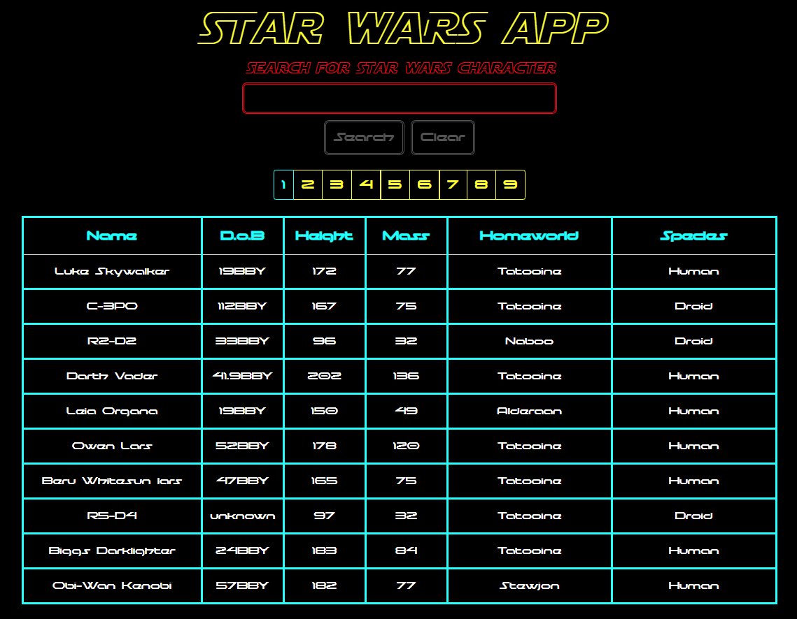

# Star Wars API App
The application was built using Reactjs and styled with Bootstrap 4

Run Code [Here](https://hc-starwars-api-app-react.herokuapp.com/)

## Summary
A Star Wars app that pulls information from a free API that holds Star Wars characters and movies. The application will take 10 characters worth of data and display it in a clean table. There is pagination to search through all characters via the selected pages. Another way to look for a character is through the search option which lets you search for a specific character by entering a portion or full name. The app also utilizes the local storage to retain the information for each page, for quick response time after initial load. It was a pleasure making this application. I was able to integrate some cool fonts and colors, paying homage to the star wars franchise.

## Author
Heriberto Cuellar – Full Stack Software Developer - [Website](https://heribertocuellar.com) | [LinkedIn](https://www.linkedin.com/in/heriberto-cuellar/)
